<!--
  Profile README — github.com/ahmedali-aihub

  Every image in assets/ is hand-built SVG, rendered by scripts/generate.py and
  refreshed by .github/workflows/profile.yml. Facts live in profile.config.json.
  Anything between START_SECTION / END_SECTION markers is overwritten on each run.
-->

<a href="https://portfolio-kappa-gold-87laqyj57s.vercel.app">
  <picture>
    <source media="(prefers-color-scheme: dark)" srcset="assets/hero-dark.svg">
    <source media="(prefers-color-scheme: light)" srcset="assets/hero-light.svg">
    
  </picture>
</a>

<picture>
  <source media="(prefers-color-scheme: dark)" srcset="assets/core-dark.svg">
  <source media="(prefers-color-scheme: light)" srcset="assets/core-light.svg">
  
</picture>

<a href="https://portfolio-kappa-gold-87laqyj57s.vercel.app">
  <picture>
    <source media="(prefers-color-scheme: dark)" srcset="assets/typing-dark.svg">
    <source media="(prefers-color-scheme: light)" srcset="assets/typing-light.svg">
    
  </picture>
</a>

  ↑ It's a prompt bar for a reason: click it to question my portfolio's live RAG assistant about my work.

  
  
  
  

<picture>
  <source media="(prefers-color-scheme: dark)" srcset="assets/specs-dark.svg">
  <source media="(prefers-color-scheme: light)" srcset="assets/specs-light.svg">
  
</picture>

## Hi, I'm Ahmed

I build the layer between large language models and real systems: retrieval that grounds answers in evidence, agents that make their own routing decisions, and models that have to beat a baseline before I call them done.

I'm an **AI/ML Associate Engineer at Yuva Intelli AI Solutions** in Hyderabad, building RAG pipelines, LLM agents and end-to-end ML workflows for production use cases. Before that I was a Data Scientist Intern at TechZone Academy.

**Ask me about:** when an agent should abstain instead of answer · two-stage retrieval with cross-encoder reranking · training sequence models on a CPU budget · keeping free-tier LLM stacks alive with multi-provider failover.

## How I work

Pulled from my own READMEs. Each one links to where you can check it.

| Principle | Where you can check it |
|---|---|
| **Beat a baseline or it didn't happen.** | GRU4Rec vs. popularity: [Recall@10 0.450 vs 0.086](https://github.com/ahmedali-aihub/Product-Recommendation-system-Using-GRU#13-results) · Agentic RAG vs. plain RAG: [0/5 vs 2/5 hallucinated](https://github.com/ahmedali-aihub/Agentic-RAG-Support-Assistant-with-Confidence-Based-Escalation#the-result) |
| **Abstaining beats hallucinating.** | A LangGraph judge routes weak-evidence questions to a [human escalation queue](https://github.com/ahmedali-aihub/Agentic-RAG-Support-Assistant-with-Confidence-Based-Escalation#how-it-decides) |
| **Report errors by direction, because they don't cost the same.** | Over-escalated vs. wrongly answered, with a [threshold sweep from 0.3 to 0.9](https://github.com/ahmedali-aihub/Agentic-RAG-Support-Assistant-with-Confidence-Based-Escalation#evaluating-it) |
| **Tests shouldn't need an API key.** | 66 backend tests with every LLM boundary mocked, [run in CI](https://github.com/ahmedali-aihub/Agentic-RAG-Support-Assistant-with-Confidence-Based-Escalation/actions/workflows/ci.yml) |
| **Money is integer paise. Never floats.** | [A to Z Fitness OS](https://github.com/ahmedali-aihub/Gym-managment-Software#notes-for-whoever-works-on-this-next) billing, with a regression test for a 20-paise rounding bug |
| **Ship the limitations section.** | Every case study below ends with one |

## Selected work

> **Click a project to open its case study:** architecture (live Mermaid, so you can zoom and pan it), measured results, the design decisions a reviewer would question, and what's still missing.

<b>Agentic RAG Support Assistant</b>: scores its own evidence and escalates instead of guessing &nbsp;<code>LangGraph</code> <code>Cross-encoder</code> <code>FastAPI</code> <code>React + TS</code>

 

**The problem.** Most RAG chatbots answer every question, including the ones their documentation can't possibly answer. This agent judges whether the retrieved passages actually support an answer *before* writing one, and hands the question to a person when they don't.

**The result.** Same questions, same index, same models:

| | Plain RAG | This agent |
|---|:-:|:-:|
| In-scope answered | 6/6 | **6/6** |
| Out-of-scope hallucinated | 2/5 | **0/5** |
| Out-of-scope escalated to a human | 0/5 | **5/5** |
| Answers lost to over-escalation | — | **0** |

It eliminated hallucinated answers on out-of-scope questions **without answering fewer in-scope ones**. Abstaining cost nothing in coverage.

**How it decides.** The judge is a LangGraph conditional edge: its verdict picks which node runs next.

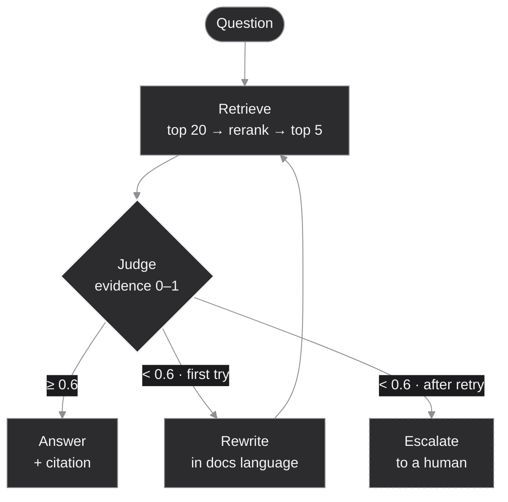

**Stack:** `LangGraph` `LangChain` `Chroma` `all-MiniLM-L6-v2` `ms-marco cross-encoder` `OpenRouter + Gemini failover` `FastAPI` `React` `TypeScript` `Tailwind` `Docker Compose` `pytest` `GitHub Actions`

<b>See it running</b>: a real answered run, screenshot from the repo

 

100% confidence against a 60% threshold, one cited source. Rewrite and Escalate are dimmed because this question never needed them.

<b>Design decisions a reviewer would ask about</b>

- **Why judge before answering?** The LLM isn't just producing text; it's making a routing decision. That's what separates an agent from a pipeline.
- **Why a cross-encoder after embeddings?** Embedding search scores question and passage separately, so it rewards topical overlap. A cross-encoder reads both together and can tell that a page mentioning refunds throughout still never explains how to issue a *partial* one. 20 candidates in, 5 out.
- **Why exactly one retry?** Customers describe symptoms; docs describe mechanisms. Restating the question in documentation language rescues vocabulary misses (it fired on 5 of 11 judged questions), and the bound means nothing spins.
- **Why report errors by direction?** Over-escalation wastes a person's time; a wrong answer reaches a customer. The threshold sweep shows bimodal confidence: routing only changes at 0.9, so the 0.6 default has slack on both sides.
- **How does it survive free tiers?** 56 model candidates across 5 API keys and 2 providers. A throttled or malformed model is skipped; a spent daily quota retires only that account.
- **Why is the eval set generated?** Its answerable half is generated *from passages the index contains*, so the passage is the ground truth, not the author's memory. A run that can't measure something excludes it instead of scoring it.

<b>Honest limitations</b>

- **Sample size:** 11 questions judged; the free-tier quota stops the run before the full 35. The direction is clear, the confidence interval isn't tight.
- **One documentation set:** built and measured on Stripe's docs. Nothing is Stripe-specific, but it hasn't been tried elsewhere.
- **A single-model judge:** a panel or a calibrated classifier would be steadier.
- **About 2× the latency of plain RAG** (warm queries take 2–11 s). Fine for support, not for autocomplete.

<b>Session-based recommender (GRU4Rec)</b>: predicts your next click from this visit alone, live on a real storefront &nbsp;<code>TensorFlow</code> <code>Sampled softmax</code> <code>MySQL</code> <code>FastAPI</code>

 

**The problem.** Classic "users who liked X" recommenders need a long-term profile. This model treats a session as a **sequence problem**: given the ordered items someone just viewed, predict the next one. It works for anonymous and brand-new users, the way modern feeds re-rank in real time.

**The result.** Held-out test set, time-based split:

| Model | Recall@10 | NDCG@10 |
|---|:-:|:-:|
| Popularity baseline | 0.0855 | — |
| **GRU4Rec** (1M-row run, the model live behind `/predict`) | **0.4502** | **0.3291** |

That's **5.3× the popularity baseline**, proof the model learned session-specific patterns, not just what's popular. On a 1-day prototype slice it reached Recall@10 = 0.3915 vs 0.0700 after 3 CPU epochs.

**The data, measured:** 20,000,000 events · 4,301,849 sessions · 2,821,965 usable (more than one event) · 141,694 products · a vocabulary of about 40K tokens (top-N plus `<OTHER>`).

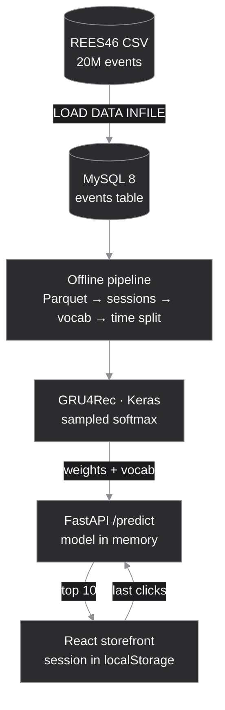

**Stack:** `TensorFlow / Keras` `custom GradientTape loop` `pandas` `PyArrow` `MySQL 8` `FastAPI` `React` `Tailwind + shadcn/ui` `Framer Motion` `Vercel` `Render` `Aiven`

<b>Design decisions a reviewer would ask about</b>

- **Why sampled softmax from day one?** On CPU, a dense softmax over about 40K items for about 15M training pairs is the dominant cost. Scoring the true item plus about 100 negatives gives an unbiased-in-expectation gradient at a fraction of the cost. Full logits are computed only where exactness matters: evaluation and serving.
- **Why are vocabulary ids ordered by frequency?** `tf.nn.sampled_softmax_loss`'s default sampler assumes exactly that, so the vocab builder assigns id 3 to the most frequent product on purpose.
- **Why a time-based split?** A random split lets the model see the future and silently inflates Recall and NDCG.
- **Why MySQL, then Parquet?** MySQL is the append-friendly system of record, bulk-loaded rather than row-by-row. Each training run exports its window to Parquet once, so the database never becomes the experiment bottleneck.
- **Why UptimeRobot instead of a GitHub cron for keep-warm?** GitHub's scheduler showed 47 to 90 minute gaps between "every 10 min" runs, long enough for the free MySQL tier to power off.

<b>Honest limitations</b>

- The live weights come from a **1M-row run, not the full 20M**. At an estimated 2.5 to 3 hours per epoch on CPU, the full run hasn't been done yet.
- Catalog **coverage isn't measured yet**, and the cold-start extension (CLIP embeddings with a FAISS fallback) is on the roadmap, not built.
- New weights take effect **after a restart**; there's no hot-reload yet.

<b>Portfolio with a live RAG assistant</b>: the chat widget is a real retrieval pipeline, not a scripted FAQ &nbsp;<code>TF-IDF retrieval</code> <code>SSE streaming</code> <code>Model fallback</code>

 

Visitors ask about my skills and projects; the answer is retrieved from a hand-written knowledge base and streamed token by token through a free-tier LLM, with automatic fallback when a model is down.

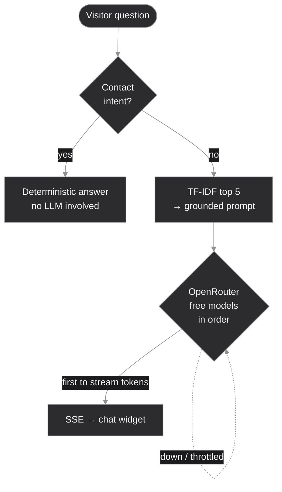

- **Why TF-IDF, not embeddings?** The corpus is a few dozen short documents about one person. An embedding model and its runtime would buy nothing here and make free-tier hosting much more expensive.
- **Why a deterministic contact answer?** I found that free models were unreliable at surfacing contact details even when retrieval and prompt were correct. For a question with exactly one right answer, the model is bypassed.
- **Why commit once tokens flow?** Switching models mid-stream would splice two voices into one answer.
- **Limitation:** the knowledge base mirrors the site's content by hand, so the two can drift.

**Stack:** `React 19` `Vite` `Tailwind 4` `Framer Motion` `FastAPI` `httpx` `scikit-learn` `Server-Sent Events` `per-IP rate limiting` `Render`

<b>A to Z Fitness OS</b>: production software for a real gym, where a bug costs real money &nbsp;<code>TypeScript</code> <code>Prisma</code> <code>PostgreSQL</code> <code>Vitest</code>

 

Members, memberships, payments, PDF receipts, SMS and WhatsApp, QR check-in, expenses with P&L, CSV import and analytics for **A to Z Fitness in Mehdipatnam, Hyderabad**. It's built for how an Indian neighbourhood gym actually runs: rupees, `dd/MM/yyyy` dates, DLT-compliant SMS, and a front desk where someone is waiting while you type.

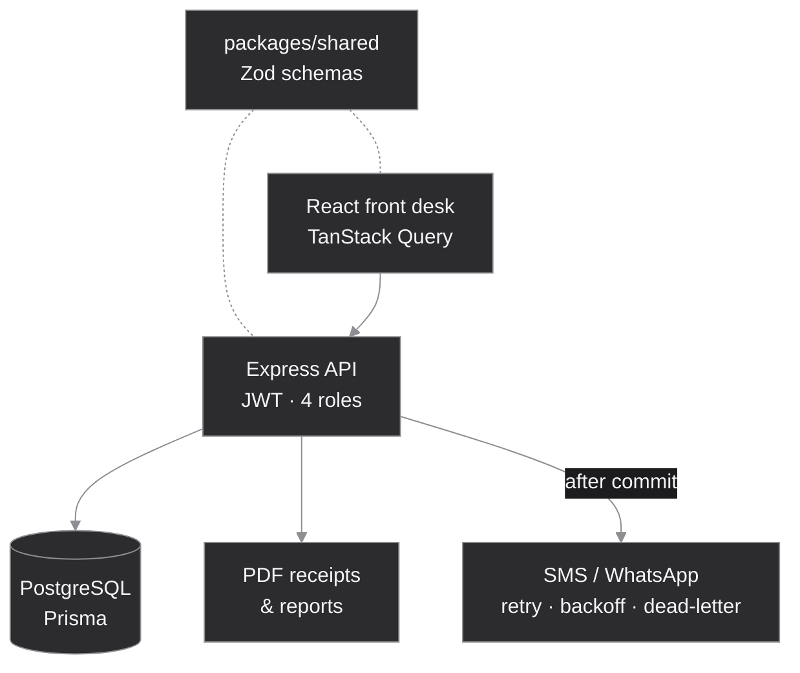

**Engineering that managers ask about:**

- **Money is integer paise.** Every monetary column is `Int`; rupees exist only at the UI boundary.
- **Receipt numbers come from counter rows**, allocated by an atomic `UPDATE … RETURNING` inside the transaction. Two simultaneous registrations can't collide, and a rollback leaves no gap.
- **Payment amounts are recomputed server-side**, and an `idempotencyKey` stops a double-click from printing two receipts for one handover of cash.
- **SMS failures never roll back a registration.** The message row is written first; delivery happens after commit.
- **GST-ready without a migration.** Flip three env vars and receipts become tax invoices with a CGST and SGST split.
- **A test that catches a `₹` in an SMS template:** one non-GSM-7 character drops the segment limit from 160 to 70 and silently doubles the cost.

**Stack:** `TypeScript monorepo` `Express` `Prisma` `PostgreSQL (Supabase)` `Zod` `React` `Vite` `TanStack Query` `Tailwind` `JWT` `pdfkit` `MSG91 / Twilio / Fast2SMS` `Meta WhatsApp` `Vitest`

<b>More work, not public yet</b>: agents, text-to-SQL, explainable ML, computer vision

 

These are listed on my portfolio. The code is private or not yet published, so none of it counts toward the numbers on this page.

| Project | What it does | Stack |
|---|---|---|
| **Agentic Conference Registration Bot** *(team)* | Searches for relevant conferences and completes registration autonomously, driving headless browsers through real sign-up flows | `Serper API` `Playwright` |
| **Calendar Agent** | Reads intent, checks availability, and books, moves or cancels events on Google Calendar | `LangGraph` `Google Calendar API` |
| **Email Agent** | Triages, drafts and handles email, routing between tool calls and models by task complexity | `LangChain` `OpenRouter` |
| **Text-to-SQL / RAG pipeline** | Translates plain-English questions into MySQL queries with retrieved schema context | `FastAPI` `SQLAlchemy` `Anthropic API` |
| **Heart disease classifier** | Decision-tree risk prediction, with SHAP so each prediction traces back to its clinical features | `scikit-learn` `SHAP` |
| **Smoking detection** | Image classifier deployed as an interactive web app | `TensorFlow / Keras` `Streamlit` |

## Experience

| Role | Company | When |
|---|---|---|
| **AI/ML Associate Engineer** | Yuva Intelli AI Solutions | May 2026 to present |
| Data Scientist Intern | TechZone Academy | Jan 2025 to May 2026 |

## Stack, with receipts

| Area | Tools | Proven in |
|---|---|---|
| Agents & LLMs | `LangGraph` `LangChain` `OpenRouter` `Gemini` `prompt design` | [Agentic RAG](https://github.com/ahmedali-aihub/Agentic-RAG-Support-Assistant-with-Confidence-Based-Escalation) · [Portfolio](https://github.com/ahmedali-aihub/Portfolio) |
| Retrieval | `Chroma` `sentence-transformers` `cross-encoder reranking` `TF-IDF` `Hugging Face models` | [Agentic RAG](https://github.com/ahmedali-aihub/Agentic-RAG-Support-Assistant-with-Confidence-Based-Escalation) · [Portfolio](https://github.com/ahmedali-aihub/Portfolio) |
| Deep learning | `TensorFlow` `Keras` `sampled softmax` `custom training loops` | [GRU4Rec](https://github.com/ahmedali-aihub/Product-Recommendation-system-Using-GRU) |
| Evaluation | `Recall@K` `NDCG@K` `baselines` `threshold sweeps` `generated eval sets` | [GRU4Rec](https://github.com/ahmedali-aihub/Product-Recommendation-system-Using-GRU) · [Agentic RAG](https://github.com/ahmedali-aihub/Agentic-RAG-Support-Assistant-with-Confidence-Based-Escalation) |
| Data | `pandas` `PyArrow / Parquet` `MySQL 8` `PostgreSQL` `Prisma` `Jupyter` | [GRU4Rec](https://github.com/ahmedali-aihub/Product-Recommendation-system-Using-GRU) · [A to Z Fitness OS](https://github.com/ahmedali-aihub/Gym-managment-Software) |
| Serving | `FastAPI` `Server-Sent Events` `Express` `Docker` `Docker Compose` | all four repos |
| Frontend | `React` `TypeScript` `Vite` `Tailwind` `Framer Motion` `TanStack Query` | all four repos |
| Shipping | `GitHub Actions` `pytest` `Vitest` `Vercel` `Render` `Aiven` `Supabase` | [CI](https://github.com/ahmedali-aihub/Agentic-RAG-Support-Assistant-with-Confidence-Based-Escalation/actions) · live demos above |

Also on my portfolio, from private work: PyTorch · SHAP · Playwright · Selenium · MCP servers · Anthropic API · SQLAlchemy · Streamlit · FAISS · Pinecone.

## Live metrics

Rendered from the GitHub API by <a href="scripts/generate.py">my own generator</a>. No third-party card services, so nothing here can rate-limit, go down, or step outside the palette.

  <picture>
    <source media="(prefers-color-scheme: dark)" srcset="assets/stats-dark.svg">
    <source media="(prefers-color-scheme: light)" srcset="assets/stats-light.svg">
    
  </picture>
  <picture>
    <source media="(prefers-color-scheme: dark)" srcset="assets/streak-dark.svg">
    <source media="(prefers-color-scheme: light)" srcset="assets/streak-light.svg">
    
  </picture>

  <picture>
    <source media="(prefers-color-scheme: dark)" srcset="assets/languages-dark.svg">
    <source media="(prefers-color-scheme: light)" srcset="assets/languages-light.svg">
    
  </picture>
  <picture>
    <source media="(prefers-color-scheme: dark)" srcset="assets/evals-dark.svg">
    <source media="(prefers-color-scheme: light)" srcset="assets/evals-light.svg">
    
  </picture>

<picture>
  <source media="(prefers-color-scheme: dark)" srcset="assets/dashboard-dark.svg">
  <source media="(prefers-color-scheme: light)" srcset="assets/dashboard-light.svg">
  
</picture>

<b>View the numbers behind these charts</b>

 

<!--START_SECTION:metrics-table-->
| Metric | Value |
|---|---:|
| Contributions since joining | 62 |
| Commits | 55 |
| Pull requests | 0 |
| Issues | 0 |
| Public repositories | 5 |
| Stars from others | 0 |
| Live demos (homepage responds) | 2 |
| Current streak | 5 days |
| Longest streak | 5 days |
| Active days since joining | 17 of 193 |
| Busiest day (12 mo) | 26 Sep 2026 · 12 |

| Language | Share | Repos |
|---|---:|---:|
| TypeScript | 40.9% | 2 |
| JavaScript | 20.8% | 4 |
| Python | 18.3% | 3 |
| CSS | 9.7% | 4 |
| Jupyter Notebook | 5.5% | 1 |
| HTML | 3.9% | 4 |

| Month | Oct | Nov | Dec | Jan | Feb | Mar | Apr | May | Jun | Jul | Aug | Sep |
|---|---:|---:|---:|---:|---:|---:|---:|---:|---:|---:|---:|---:|
| Contributions | 0 | 0 | 0 | 0 | 0 | 1 | 0 | 0 | 0 | 0 | 13 | 48 |
<!--END_SECTION:metrics-table-->

## Recent activity

<!--START_SECTION:activity-->
- <code>25 Sep</code>&nbsp; Pushed to <a href="https://github.com/ahmedali-aihub/Gym-managment-Software">A to Z Fitness OS</a>
- <code>24 Sep</code>&nbsp; Pushed to <a href="https://github.com/ahmedali-aihub/Gym-managment-Software">A to Z Fitness OS</a> · 8 pushes
- <code>23 Sep</code>&nbsp; Pushed to <a href="https://github.com/ahmedali-aihub/Gym-managment-Software">A to Z Fitness OS</a> · 15 pushes
- <code>22 Sep</code>&nbsp; Pushed to <a href="https://github.com/ahmedali-aihub/Agentic-RAG-Support-Assistant-with-Confidence-Based-Escalation">Agentic RAG Support Assistant</a>
- <code>15 Sep</code>&nbsp; Pushed to <a href="https://github.com/ahmedali-aihub/Agentic-RAG-Support-Assistant-with-Confidence-Based-Escalation">Agentic RAG Support Assistant</a> · 6 pushes
- <code>13 Sep</code>&nbsp; Pushed to <a href="https://github.com/ahmedali-aihub/Agentic-RAG-Support-Assistant-with-Confidence-Based-Escalation">Agentic RAG Support Assistant</a> · 9 pushes
- <code>12 Sep</code>&nbsp; Pushed to <a href="https://github.com/ahmedali-aihub/Agentic-RAG-Support-Assistant-with-Confidence-Based-Escalation">Agentic RAG Support Assistant</a> · 5 pushes
<!--END_SECTION:activity-->

<picture>
  <source media="(prefers-color-scheme: dark)" srcset="assets/divider-dark.svg">
  <source media="(prefers-color-scheme: light)" srcset="assets/divider-light.svg">
  
</picture>

  <b>Hiring for GenAI, agents or applied ML?</b> Let's talk. 
  <a href="https://www.linkedin.com/in/ahmed-ali-aiml2006/">LinkedIn</a> · <a href="https://portfolio-kappa-gold-87laqyj57s.vercel.app">Portfolio</a> · <a href="https://github.com/ahmedali-aihub?tab=repositories">All repositories</a>

<picture>
  <source media="(prefers-color-scheme: dark)" srcset="assets/footer-dark.svg">
  <source media="(prefers-color-scheme: light)" srcset="assets/footer-light.svg">
  
</picture>
